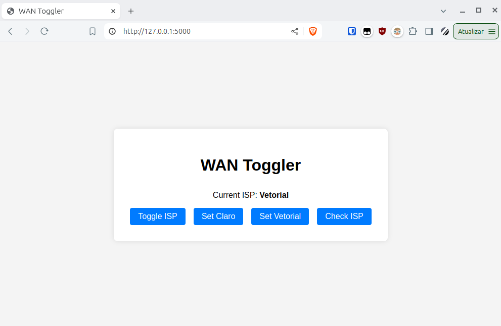

# WAN Toggler (For Mikrotik)

WAN-Toggler is a Flask application that allows you to toggle and set your WAN interface on a MikroTik router. It provides a simple web interface with authentication and periodic refresh options.

## Screenshots




## Features

- Toggle between WAN interfaces
- Set specific WAN interfaces
- Check current WAN interface
- Basic authentication
- Automatic page refresh

## Requirements

- Python 3.x
- Flask
- Paramiko
- python-dotenv

## Installation

1. Clone the repository:

    ```sh
    git clone https://github.com/eduardogsilva/wan-toggler.git
    cd wan-toggler
    ```

2. Install the required Python packages:

    ```sh
    pip install -r requirements.txt
    ```

3. Create a `.env` file in the project root directory based on the `.env.example` file:

    ```sh
    cp .env.example .env
    ```

4. Configure the `.env` file according to your environment.

5. Run the Flask application:

    ```sh
    python app.py
    ```

## MikroTik Script Configuration

Install the scripts located in the `mikrotik-scripts` directory on your MikroTik router.

### Notes on MikroTik Scripts

To switch the ISP, the scripts adjust the distance of the routes. The active ISP has a distance of 20, and the backup ISP has a distance of 25. The scripts assume that the user has DHCP clients on both ISPs. If you have a different scenario or want to customize the way the active link is switched, you can personalize the scripts as long as they maintain the same functionality.

## Usage

1. Open your web browser and navigate to `http://127.0.0.1:5000/`.
2. Log in using the credentials set in your `.env` file. 
3. Use the web interface to toggle or set the WAN interface and check the current WAN interface.

## License

This project is licensed under the MIT License.
